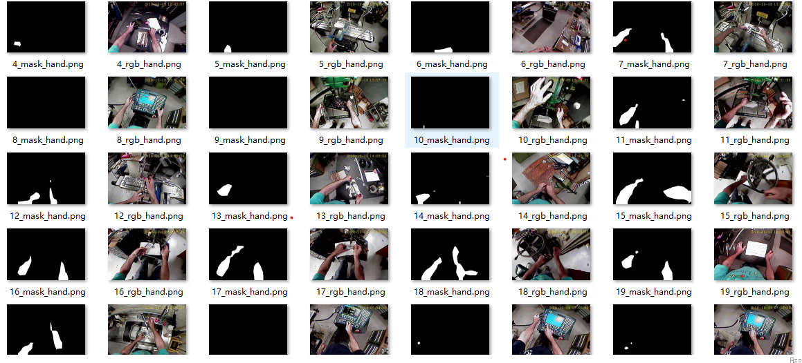

## environment
conda: conda install environment.yml  
or  
virtualenv: pip install -r requirements.txt  

## usage

##### run commands
activate your_virtual_env_name  
jupyter notebook
#### train or predict
main->fcn.ipynb (run it to trian model)  
or  
main -> predict.ipynb (run it to predict hand picture)  
#### data 
Put your data in the file dir "data" and gain result in dir "test_rgb_and_mask"  

## result


## others

My trained model and result :
url：https://pan.baidu.com/s/1sYBSJAEVFccRTLGjJzeD0Q 
password：n81z 


```python

```
